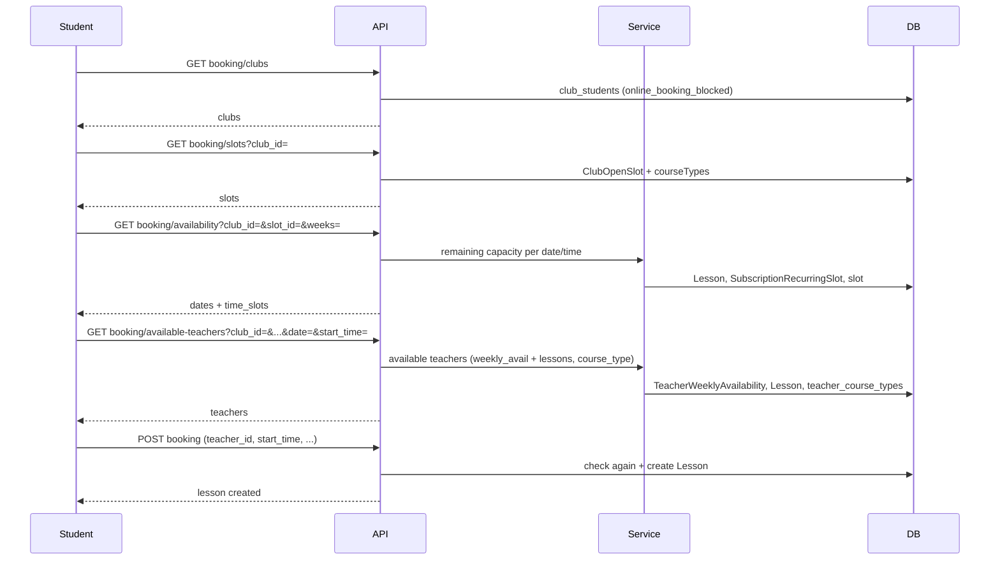

# Plan : Réservation en ligne par les élèves (disponibilités, blocage, enseignants)

## Contexte

Aujourd’hui, l’élève réserve via des cours déjà en statut `available` (getAvailableLessons → createBooking(lesson_id)). Le besoin est un flux basé sur les **créneaux du club** et les **disponibilités des enseignants** : l’élève choisit un créneau, une date/heure encore dispo, puis un enseignant disponible, et le système crée le cours à la réservation.

---

## 1. Blocage « prise de cours en ligne » par élève

**Objectif**  
Le club peut interdire à un élève de prendre des cours en ligne (tout en le gardant actif pour le reste).

**Existant**  
- `club_students` : `is_blocked`, `subscription_creation_blocked` (déjà utilisés).  
- Pas de flag dédié « réservation en ligne ».

**Proposition**

- Ajouter sur `club_students` un booléen **`online_booking_blocked`** (défaut `false` = autorisé).
- Migration : `add_online_booking_blocked_to_club_students`.
- Modèles : exposer le champ dans le pivot (Club, Student, club_students).
- API club : étendre **PATCH** `club/students/{studentId}/block-flags` pour accepter `online_booking_blocked` (comme pour `is_blocked` / `subscription_creation_blocked`).
- Frontend club : dans la fiche élève (ou liste élèves), ajouter un réglage « Peut prendre des cours en ligne » (toggle lié à `online_booking_blocked`).
- Côté student : toute API de réservation (liste des créneaux, créneaux disponibles, enseignants disponibles, création de réservation) doit vérifier que, pour le club concerné, `online_booking_blocked` est false ; sinon 403 + message clair.

**Fichiers concernés**

- Nouvelle migration.  
- `App\Models\Club`, `App\Models\Student` (pivot).  
- `App\Http\Controllers\Api\StudentController::updateBlockFlags`.  
- Contrôleur(s) student pour la réservation (voir §4).  
- Frontend : page(s) club gestion élève + éventuellement store/API.

---

## 2. Disponibilités des enseignants (jour / horaire)

**Objectif**  
Avoir une notion de disponibilité par jour et plage horaire, que le club peut mettre à jour, et utiliser cette donnée pour savoir quels enseignants sont disponibles à une date/heure donnée.

**Existant**

- **Availability** : `teacher_id`, `location_id`, `start_time`, `end_time` (datetime), `is_available`. Plages à des dates précises (pas récurrentes).
- **TeacherContract** : `unavailable_days`, `earliest_start_time`, `latest_end_time` (contraintes larges, pas des créneaux précis).

**Proposition**

- Introduire un modèle **TeacherWeeklyAvailability** (ou table `teacher_weekly_availabilities`) :  
  - `teacher_id`, `club_id` (optionnel mais utile si un enseignant a des dispos différentes par club),  
  - `day_of_week` (0–6),  
  - `start_time`, `end_time` (type time),  
  - `is_available` (booléan, défaut true).  
- Une ligne = « ce professeur est dispo ce jour-là entre start_time et end_time » (récurrent chaque semaine).  
- Le club peut **CRUD** ces plages pour chaque enseignant du club (écran « Disponibilités » par enseignant : liste jour + début/fin, ajout/modification/suppression).
- Logique « est disponible à la date D et l’heure H » :  
  - D a un jour de semaine `day_of_week` ;  
  - il existe une TeacherWeeklyAvailability pour ce `teacher_id` (et éventuellement ce `club_id`) avec ce `day_of_week` et H dans [start_time, end_time], `is_available = true` ;  
  - et pas de cours (Lesson) déjà assigné à ce teacher à ce moment (conflit horaire).
- On peut conserver le modèle **Availability** pour des exceptions ponctuelles (ex. « indisponible le 25/12 ») si besoin plus tard ; dans un premier temps, la liste des enseignants disponibles peut reposer uniquement sur TeacherWeeklyAvailability + conflits de cours.

**Fichiers concernés**

- Migration `create_teacher_weekly_availabilities_table`.  
- Modèle `TeacherWeeklyAvailability`, relation depuis `Teacher` (et éventuellement `Club`).  
- Service ou helper « enseignants disponibles à (club, date, heure, course_type_id) » (voir §4).  
- API club : CRUD des disponibilités hebdo (ex. `GET/POST/PUT/DELETE club/teachers/{id}/weekly-availabilities` ou `club/availabilities/teacher/{id}`).  
- Frontend club : page ou section « Disponibilités » par enseignant (liste, formulaire ajout/édition).

---

## 3. Affectation du cours à l’enseignant (côté élève)

**Objectif**  
L’affectation se fait par le choix de l’élève parmi une liste d’enseignants **disponibles** (dispo jour/horaire + pas déjà un cours à cette heure, et qui enseignent le type de cours).

**Règle**

- Pour un créneau (club + type de cours ou slot) + date + heure :  
  - on restreint aux enseignants du club qui :  
    - enseignent ce type de cours (relation teacher ↔ course_type, ex. `teacher_course_types`),  
    - ont une disponibilité hebdo qui couvre ce jour et cette heure (TeacherWeeklyAvailability),  
    - n’ont pas déjà un cours (Lesson) à ce créneau horaire (même date, même plage horaire).  
- L’élève reçoit cette liste et choisit un enseignant ; la réservation crée alors un **Lesson** avec ce `teacher_id`.

Aucune « affectation automatique » côté back : l’affectation = le choix de l’élève parmi les enseignants disponibles.

**Fichiers concernés**

- Service ou méthode dédiée (ex. dans un `StudentBookingService` ou dans le contrôleur student) : `getAvailableTeachersForSlot( club_id, course_type_id, date, start_time, end_time )` qui applique les critères ci-dessus.  
- API exposée au front student (voir §4).

---

## 4. APIs et parcours élève (créneau → heure → enseignant → réservation)

**Parcours cible**

1. L’élève choisit un **club** (parmi ceux où il est inscrit et où `online_booking_blocked` est false).  
2. Pour ce club, il voit les **créneaux** (ex. basés sur **ClubOpenSlot** : jour de la semaine, plage horaire, discipline, types de cours).  
3. Pour un créneau (et éventuellement un type de cours), il voit les **dates** à venir (ex. prochaines N semaines) où ce créneau s’applique, et pour chaque date les **heures** encore disponibles (capacité restante, sans double réservation).  
4. Il choisit une **date** et une **heure**.  
5. Il reçoit la **liste des enseignants disponibles** pour (club, type de cours, date, heure).  
6. Il choisit un **enseignant**.  
7. Il confirme → **création du cours** (Lesson) avec ce teacher_id, student_id, club_id, course_type_id, start_time/end_time, etc., et règles existantes (abonnement, récurrence, etc.).

**APIs à mettre en place (préfixe student)**

- **GET** `student/booking/clubs`  
  - Clubs où l’élève peut réserver (inscrit + non bloqué en ligne).  
  - Réponse : liste des clubs (id, name, …) avec indication `online_booking_blocked` si utile.

- **GET** `student/booking/slots`  
  - Query : `club_id` (obligatoire).  
  - Vérifier que l’élève est bien inscrit au club et que `online_booking_blocked` est false.  
  - Réponse : créneaux du club (ex. ClubOpenSlot actifs avec course types, jour, plage horaire, durée, etc.).

- **GET** `student/booking/availability`  
  - Query : `club_id`, `slot_id` (open_slot_id), `course_type_id` (optionnel si dérivé du slot), `weeks` (optionnel, défaut 4).  
  - Pour chaque date concernée (selon day_of_week du slot) sur les N semaines : pour chaque « pas » horaire dans la plage du slot, retourner si la capacité restante > 0 (réutiliser une logique type ClubPlanningController::availabilityByWeek, mais exposée et sécurisée pour un élève).  
  - Réponse : par date, liste des créneaux horaires encore disponibles (ex. `{ date, time_slots: [{ start, end, remaining }] }`).

- **GET** `student/booking/available-teachers`  
  - Query : `club_id`, `slot_id` ou `course_type_id`, `date`, `start_time` (et durée ou `end_time`).  
  - Vérifier capacité + `online_booking_blocked`.  
  - Réponse : liste des enseignants disponibles (id, name, …) selon la règle du §3.

- **POST** `student/booking`  
  - Body : `club_id`, `teacher_id`, `course_type_id`, `start_time`, `end_time` (ou `slot_id` + `date` + `start_time` + durée), optionnel `deduct_from_subscription`, `location_id`, etc.  
  - Vérifications : élève inscrit, pas `online_booking_blocked`, enseignant bien dans la liste des disponibles, capacité OK, pas de conflit.  
  - Créer le **Lesson** (status `confirmed` ou `pending` selon la règle métier actuelle), lier à l’abonnement si besoin, déclencher les jobs/notifications existants.  
  - Réutiliser au maximum la logique de **LessonController::store** (validation, création, déduction abo, récurrence, etc.) en l’appelant ou en la factorisant pour éviter duplication.

**Sécurité et cohérence**

- Toutes ces routes : middleware `auth:sanctum`, `student`, `active.student`.  
- Vérifier systématiquement `club_students` (appartenance au club + `online_booking_blocked`).  
- En création de cours : transaction + vérification une dernière fois de la capacité et du conflit enseignant pour éviter les doubles réservations.

**Fichiers concernés**

- Nouveau contrôleur ou extension du **Student\DashboardController** (ou **Student\BookingController** dédié) pour les nouvelles routes.  
- Service ou classe helper pour :  
  - calcul des plages encore disponibles (slot + date + capacité),  
  - liste des enseignants disponibles (TeacherWeeklyAvailability + cours existants + course_type).  
- `routes/api.php` : enregistrer les routes sous le préfixe `student`.  
- Frontend student : nouvelles pages/composants (choix club → créneaux → date/heure → choix enseignant → confirmation).

---

## 5. Club : mise à jour des disponibilités des enseignants

**Objectif**  
Le club peut consulter et modifier les disponibilités (jour/horaire) des enseignants.

**Proposition**

- API club (déjà évoquée en §2) :  
  - **GET** `club/teachers/{teacherId}/weekly-availabilities`  
  - **POST** `club/teachers/{teacherId}/weekly-availabilities` (body : day_of_week, start_time, end_time)  
  - **PUT** `club/teachers/{teacherId}/weekly-availabilities/{id}`  
  - **DELETE** `club/teachers/{teacherId}/weekly-availabilities/{id}`  
- Contrôle d’accès : l’enseignant doit appartenir au club de l’utilisateur (club).  
- Frontend club : écran « Enseignants » → clic sur un enseignant → onglet ou section « Disponibilités » avec tableau des plages (jour, début, fin) et boutons Ajouter / Modifier / Supprimer.

**Fichiers concernés**

- Contrôleur club (ex. `ClubTeacherAvailabilityController` ou méthode dans `ClubController` / `ClubTeacherController`).  
- Frontend : page ou composant « Disponibilités » dans la fiche enseignant.

---

## 6. Récap flux de données

---

## 7. Revue du plan (contrôles)

- **Blocage par élève** : flag dédié `online_booking_blocked` sur `club_students`, exposé en API club et vérifié sur toutes les APIs de réservation.  
- **Disponibilités enseignants** : modèle récurrent **TeacherWeeklyAvailability** (jour + heure), CRUD côté club, utilisé pour « enseignants disponibles à date/heure ».  
- **Affectation** : l’élève choisit l’enseignant parmi la liste calculée (dispo + type de cours + pas de cours en conflit).  
- **Parcours élève** : club → créneaux → disponibilités (dates/heures) → enseignants disponibles → création du cours.  
- **Club** : peut mettre à jour les disponibilités (CRUD weekly availabilities) et peut bloquer la réservation en ligne par élève (block-flags).  
- **Cohérence** :  
  - Vérification capacité et conflit enseignant au moment de la création du cours (transaction).  
  - Réutilisation de la logique métier existante (Lesson, abonnement, notifications) pour la création du cours.  
- **Existant** :  
  - `getAvailableLessons` / `createBooking(lesson_id)` peut rester en parallèle (cours déjà en « available ») ou être déprécié selon la stratégie produit.  
  - Ne pas casser les flux club/teacher (création de cours côté club, planning, etc.).  

**Points optionnels à trancher**

- **Location** : le Lesson requiert un `location_id` ; à prendre par défaut depuis le club ou depuis le créneau si on ajoute un champ lieu sur ClubOpenSlot.  
- **Abonnement** : exiger un abonnement actif pour réserver (et déduire) ou autoriser la réservation « séance libre » ; réutiliser les règles actuelles de LessonController.  
- **Notifications** : s’assurer que la création de cours côté student déclenche les mêmes notifications (club, enseignant) que la création côté club.

---

## 8. Ordre de mise en œuvre suggéré

1. Migration + modèle **TeacherWeeklyAvailability** et relation Teacher.  
2. Migration **online_booking_blocked** + mise à jour pivot et **updateBlockFlags**.  
3. Service « enseignants disponibles » (TeacherWeeklyAvailability + cours + course_type).  
4. API club CRUD **weekly-availabilities** + frontend club (disponibilités par enseignant).  
5. API student **booking/clubs**, **booking/slots**, **booking/availability**, **booking/available-teachers**, **POST booking**.  
6. Frontend student : parcours complet (club → slot → date/heure → enseignant → confirmation).  
7. Frontend club : toggle « Peut prendre des cours en ligne » sur la fiche élève.  
8. Tests (feature + unit) sur les nouveaux endpoints et la logique de disponibilité.
