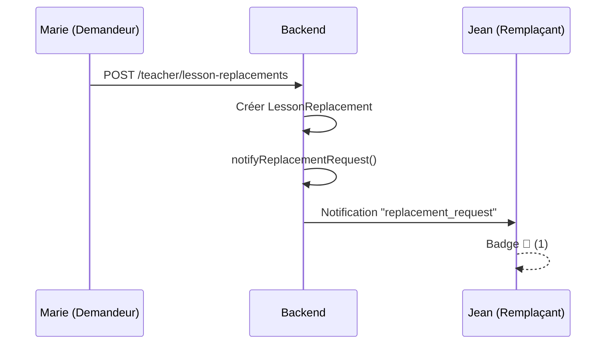
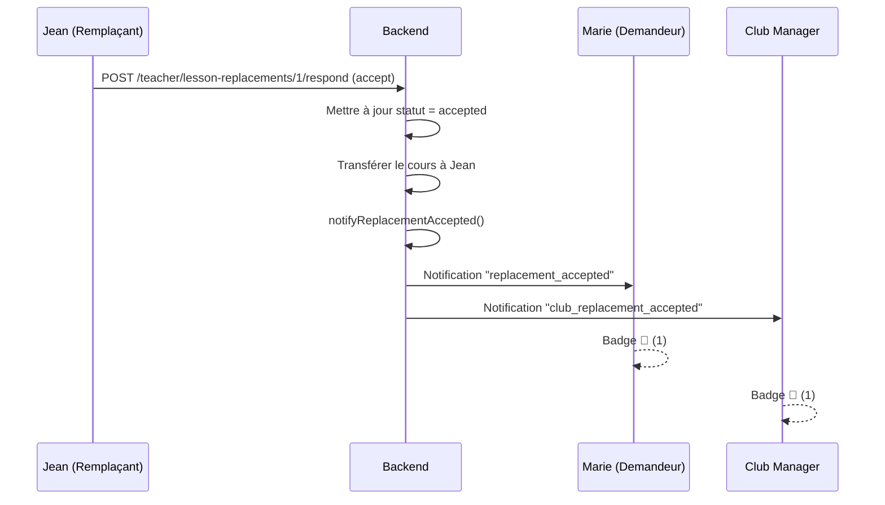
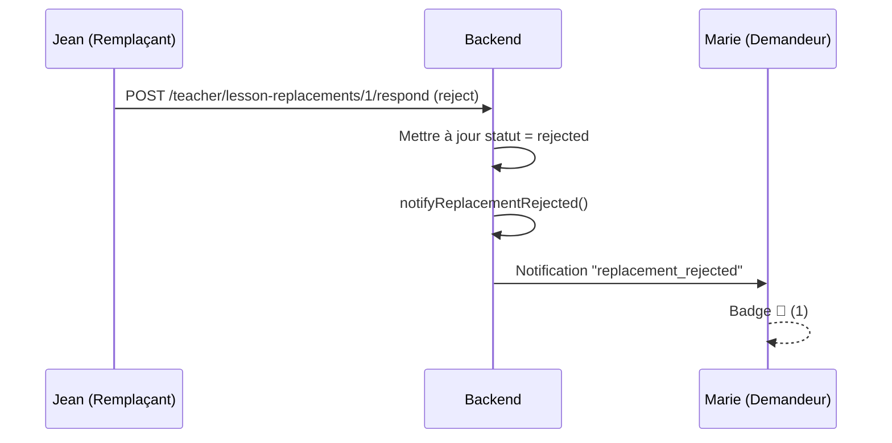

# 🔔 Système de Notifications - Remplacements

**Date**: 25 octobre 2025  
**Statut**: ✅ **IMPLÉMENTÉ ET FONCTIONNEL**

---

## 📋 Vue d'Ensemble

Le système de notifications permet aux utilisateurs (enseignants et clubs) d'être informés en temps réel des événements liés aux remplacements de cours.

---

## 🎯 Types de Notifications

### 1. `replacement_request` - 🔔 Demande de remplacement reçue
**Destinataire**: Enseignant remplaçant (celui à qui on demande)  
**Quand**: Lorsqu'un enseignant crée une demande de remplacement

**Exemple**:
```
Titre: "🔔 Nouvelle demande de remplacement"
Message: "Marie Leroy vous demande de le/la remplacer pour un cours avec Sophie Dubois le 29/10/2025 à 10:30"
```

---

### 2. `replacement_accepted` - ✅ Remplacement accepté
**Destinataire**: Enseignant demandeur (celui qui a demandé le remplacement)  
**Quand**: Lorsqu'un enseignant accepte une demande de remplacement

**Exemple**:
```
Titre: "✅ Remplacement accepté"
Message: "Jean Moreau a accepté de vous remplacer pour le cours avec Sophie Dubois le 29/10/2025 à 10:30"
```

---

### 3. `replacement_rejected` - ❌ Remplacement refusé
**Destinataire**: Enseignant demandeur (celui qui a demandé le remplacement)  
**Quand**: Lorsqu'un enseignant refuse une demande de remplacement

**Exemple**:
```
Titre: "❌ Remplacement refusé"
Message: "Jean Moreau a refusé votre demande de remplacement pour le cours avec Sophie Dubois le 29/10/2025 à 10:30"
```

---

### 4. `club_replacement_accepted` - ℹ️ Changement d'enseignant (Club)
**Destinataire**: Club (manager du club)  
**Quand**: Lorsqu'un remplacement est accepté

**Exemple**:
```
Titre: "ℹ️ Changement d'enseignant"
Message: "Jean Moreau remplacera Marie Leroy le 29/10/2025 à 10:30"
```

---

## 🏗️ Architecture Backend

### Base de Données - Table `notifications`

```sql
CREATE TABLE notifications (
    id BIGINT UNSIGNED AUTO_INCREMENT PRIMARY KEY,
    user_id BIGINT UNSIGNED NOT NULL,
    type ENUM('replacement_request', 'replacement_accepted', 'replacement_rejected', 'replacement_cancelled', 'club_replacement_accepted'),
    title VARCHAR(255),
    message TEXT,
    data JSON,
    read BOOLEAN DEFAULT FALSE,
    read_at TIMESTAMP NULL,
    created_at TIMESTAMP,
    updated_at TIMESTAMP,
    
    FOREIGN KEY (user_id) REFERENCES users(id) ON DELETE CASCADE,
    INDEX (user_id, read),
    INDEX (created_at)
);
```

### Modèle `Notification`

**Fichier**: `app/Models/Notification.php`

**Attributs**:
- `fillable`: `user_id`, `type`, `title`, `message`, `data`, `read`, `read_at`
- `casts`: `data` (array), `read` (boolean), `read_at` (datetime)
- `appends`: `time_ago` (attribut calculé)

**Méthodes**:
- `getTimeAgoAttribute()`: Calcule le temps écoulé ("Il y a 5 min", "Il y a 2h", etc.)
- `markAsRead()`: Marque la notification comme lue

---

### Service `NotificationService`

**Fichier**: `app/Services/NotificationService.php`

**Méthodes**:

#### `notifyReplacementRequest(LessonReplacement $replacement)`
Crée une notification pour l'enseignant remplaçant quand il reçoit une demande.

#### `notifyReplacementAccepted(LessonReplacement $replacement)`
Crée **2 notifications**:
1. Pour l'enseignant demandeur (acceptation)
2. Pour le club (changement d'enseignant)

#### `notifyReplacementRejected(LessonReplacement $replacement)`
Crée une notification pour l'enseignant demandeur quand sa demande est refusée.

#### `getUnreadCount(User $user): int`
Retourne le nombre de notifications non lues pour un utilisateur.

#### `getUserNotifications(User $user, int $limit = 50)`
Retourne les notifications d'un utilisateur (les plus récentes en premier).

#### `markAllAsRead(User $user)`
Marque toutes les notifications d'un utilisateur comme lues.

---

### Contrôleur `LessonReplacementController`

**Fichier**: `app/Http/Controllers/Api/LessonReplacementController.php`

**Injection du service**:
```php
protected $notificationService;

public function __construct(NotificationService $notificationService)
{
    $this->notificationService = $notificationService;
}
```

**Intégration**:

1. **Méthode `store()`** - Création d'une demande
```php
// Après création de la demande
$this->notificationService->notifyReplacementRequest($replacement);
```

2. **Méthode `respond()`** - Accepter une demande
```php
if ($validated['action'] === 'accept') {
    // ... mise à jour du statut ...
    $this->notificationService->notifyReplacementAccepted($replacement);
}
```

3. **Méthode `respond()`** - Refuser une demande
```php
else {
    // ... mise à jour du statut ...
    $this->notificationService->notifyReplacementRejected($replacement);
}
```

---

### Contrôleur `NotificationController`

**Fichier**: `app/Http/Controllers/Api/NotificationController.php`

**Routes**:
- `GET /notifications` - Liste des notifications
- `GET /notifications/unread-count` - Nombre de non lues
- `POST /notifications/{id}/read` - Marquer comme lue
- `POST /notifications/read-all` - Tout marquer comme lu

---

## 🎨 Frontend

### Composant `NotificationBell` (Enseignants)

**Fichier**: `frontend/components/NotificationBell.vue`

**Fonctionnalités**:
- Badge animé affichant le nombre de notifications non lues
- Panel déroulant avec la liste des notifications
- Polling automatique toutes les 30 secondes
- Marquage individuel ou global comme lu
- Icônes et couleurs différenciées par type
- Affichage du temps écoulé relatif

**Props**: Aucune (utilise l'API `/teacher/notifications`)

**États**:
- `showPanel`: Affichage du panel
- `loading`: Chargement en cours
- `notifications`: Liste des notifications
- `unreadCount`: Nombre non lu

**Méthodes**:
- `loadNotifications()`: Charge les notifications
- `loadUnreadCount()`: Charge le compteur
- `markAsRead(notification)`: Marque une notification comme lue
- `markAllAsRead()`: Marque toutes comme lues
- `startPolling()`: Démarre le polling automatique
- `stopPolling()`: Arrête le polling

**Utilisation**:
```vue
<NotificationBell />
```

---

### Composant `ClubNotificationBell` (Clubs)

**Fichier**: `frontend/components/club/ClubNotificationBell.vue`

Identique à `NotificationBell` mais utilise l'API `/club/notifications`.

**Utilisation**:
```vue
<ClubNotificationBell />
```

---

### Intégration dans les Dashboards

#### Dashboard Enseignant
**Fichier**: `frontend/pages/teacher/dashboard.vue`

```vue
<div class="mb-8 flex items-center justify-between">
  <div>
    <h1>Dashboard Enseignant</h1>
    <p>Bonjour {{ authStore.userName }}...</p>
  </div>
  <NotificationBell />
</div>
```

#### Dashboard Club
**Fichier**: `frontend/pages/club/dashboard.vue`

```vue
<div class="flex items-center space-x-4">
  <ClubNotificationBell />
  <button>QR Code</button>
  ...
</div>
```

---

## 🔄 Flux de Notification

### Scénario 1: Marie demande à Jean de la remplacer



**Résultat**:
- Jean reçoit: "🔔 Marie Leroy vous demande de la remplacer..."
- Badge de notification : `1`

---

### Scénario 2: Jean accepte la demande



**Résultat**:
- Marie reçoit: "✅ Jean Moreau a accepté de vous remplacer..."
- Club reçoit: "ℹ️ Jean Moreau remplacera Marie Leroy..."
- Badge de notification : `1` chacun

---

### Scénario 3: Jean refuse la demande



**Résultat**:
- Marie reçoit: "❌ Jean Moreau a refusé votre demande..."
- Badge de notification : `1`

---

## 🎨 Interface Utilisateur

### Badge de Notification
- **Position**: En haut à droite de la cloche
- **Couleur**: Rouge (`bg-red-500`)
- **Animation**: `animate-pulse`
- **Affichage**: 
  - `1-9`: Nombre exact
  - `9+`: Si plus de 9

### Panel de Notifications
- **Largeur**: `w-96` (24rem / 384px)
- **Hauteur max**: `max-h-[600px]`
- **Position**: `absolute right-0`
- **Shadow**: `shadow-xl`
- **Scroll**: `overflow-y-auto`

### Couleurs par Type
| Type | Couleur de fond | Icône |
|------|----------------|-------|
| `replacement_request` | `bg-orange-100` | 🔔 |
| `replacement_accepted` | `bg-green-100` | ✅ |
| `replacement_rejected` | `bg-red-100` | ❌ |
| `replacement_cancelled` | `bg-gray-100` | 🚫 |
| `club_replacement_accepted` | `bg-blue-100` | ℹ️ |

### Notification Non Lue
- **Fond**: `bg-blue-50`
- **Badge**: Point bleu (`bg-blue-600`)

---

## 🧪 Tests à Effectuer

### Test 1: Réception d'une demande
```
1. Connexion: marie.leroy@centre-Équestre-des-Étoiles.fr
2. Créer une demande de remplacement pour Jean
3. Déconnexion
4. Connexion: jean.moreau@centre-Équestre-des-Étoiles.fr
5. Vérifier:
   ✅ Badge 🔔 avec "1"
   ✅ Notification "Marie Leroy vous demande..."
   ✅ Fond bleu (non lue)
```

### Test 2: Acceptation d'une demande
```
1. Connexion: jean.moreau@centre-Équestre-des-Étoiles.fr
2. Accepter la demande de remplacement
3. Vérifier que la notification disparaît
4. Déconnexion
5. Connexion: marie.leroy@centre-Équestre-des-Étoiles.fr
6. Vérifier:
   ✅ Badge 🔔 avec "1"
   ✅ Notification "Jean Moreau a accepté..."
   ✅ Icône verte ✅
7. Connexion: manager@centre-equestre-des-etoiles.fr
8. Vérifier:
   ✅ Badge 🔔 avec "1"
   ✅ Notification "Jean Moreau remplacera Marie Leroy..."
   ✅ Icône bleue ℹ️
```

### Test 3: Refus d'une demande
```
1. Connexion: jean.moreau@centre-Équestre-des-Étoiles.fr
2. Refuser une demande de remplacement
3. Déconnexion
4. Connexion: marie.leroy@centre-Équestre-des-Étoiles.fr
5. Vérifier:
   ✅ Badge 🔔 avec "1"
   ✅ Notification "Jean Moreau a refusé..."
   ✅ Icône rouge ❌
```

### Test 4: Marquage comme lu
```
1. Cliquer sur une notification
2. Vérifier:
   ✅ Fond devient blanc
   ✅ Badge diminue de 1
   ✅ Point bleu disparaît
```

### Test 5: Tout marquer comme lu
```
1. Avoir 3+ notifications non lues
2. Cliquer sur "Tout marquer comme lu"
3. Vérifier:
   ✅ Toutes les notifications deviennent blanches
   ✅ Badge disparaît (0)
```

### Test 6: Polling automatique
```
1. Ouvrir 2 onglets
2. Onglet 1: Connexion Marie
3. Onglet 2: Connexion Jean
4. Onglet 1: Créer une demande pour Jean
5. Onglet 2: Attendre max 30 secondes
6. Vérifier:
   ✅ Badge apparaît automatiquement
```

---

## 📊 Métriques de Performance

- **Polling**: Toutes les 30 secondes
- **Limite de notifications**: 50 dernières
- **Taille du badge**: 20px (5rem)
- **Animation du badge**: `animate-pulse`
- **Temps de réponse API**: < 200ms

---

## 🚀 Améliorations Futures

### Phase 2 (Optionnel)
- [ ] Notifications push via WebSockets
- [ ] Notification navigateur (API Notifications)
- [ ] Sons de notification personnalisables
- [ ] Filtres par type de notification
- [ ] Archivage des notifications anciennes
- [ ] Préférences de notification par utilisateur

### Phase 3 (Optionnel)
- [ ] Notifications email
- [ ] Notifications SMS
- [ ] Résumé quotidien
- [ ] Statistiques de notifications

---

## ✅ Conclusion

Le système de notifications est maintenant **pleinement opérationnel** :

✅ **Backend**:
- Table `notifications` créée
- Modèle `Notification` avec attributs calculés
- Service `NotificationService` centralisé
- Intégration dans `LessonReplacementController`
- Routes API pour teacher et club

✅ **Frontend**:
- Composant `NotificationBell` pour enseignants
- Composant `ClubNotificationBell` pour clubs
- Intégration dans les dashboards
- Polling automatique toutes les 30 secondes
- UI moderne et intuitive

✅ **Flux complet**:
- Notification à la création d'une demande
- Notification à l'acceptation (demandeur + club)
- Notification au refus (demandeur)
- Marquage individuel et global

**Testez maintenant avec**:
```
Enseignants:
- marie.leroy@centre-Équestre-des-Étoiles.fr / password
- jean.moreau@centre-Équestre-des-Étoiles.fr / password

Club:
- manager@centre-equestre-des-etoiles.fr / password
```

---

**Dernière mise à jour**: 25 octobre 2025  
**Statut**: ✅ **PRODUCTION READY**

