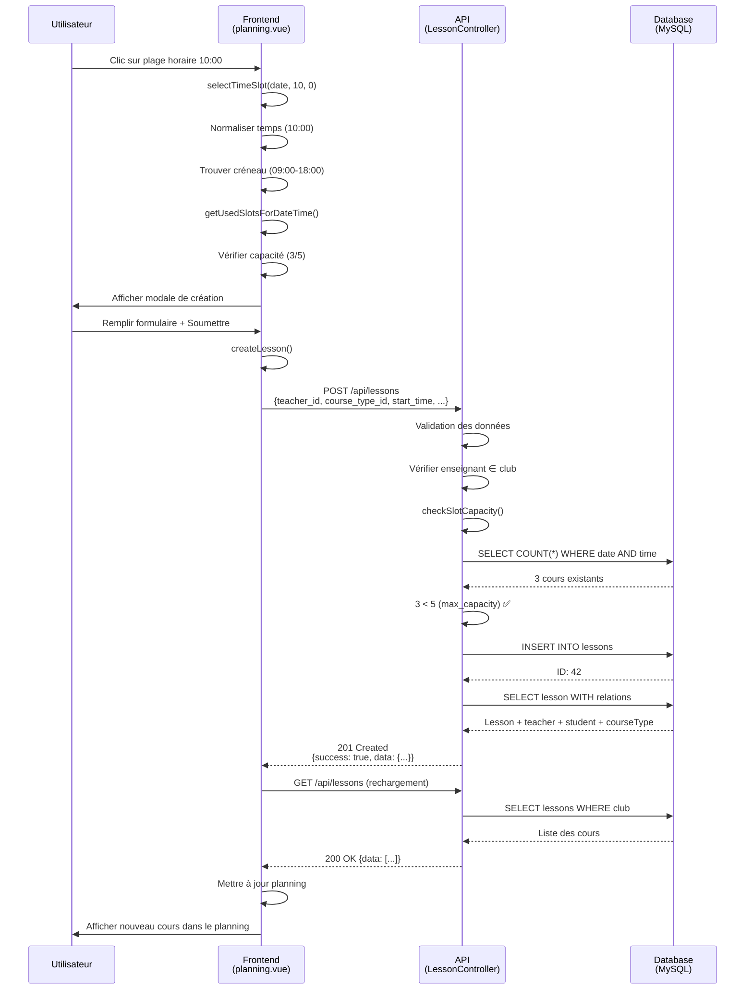

# Flux de Création de Cours - Documentation Technique

## Vue d'ensemble

Ce document décrit le flux complet de création d'un cours dans BookYourCoach, de l'interface utilisateur jusqu'à la base de données.

## Architecture du flux

```
┌─────────────────┐       ┌──────────────────┐       ┌─────────────────┐
│   Frontend      │──────▶│    Backend       │──────▶│   Database      │
│  (Vue/Nuxt)     │◀──────│    (Laravel)     │◀──────│   (MySQL)       │
└─────────────────┘       └──────────────────┘       └─────────────────┘
     planning.vue          LessonController.php        lessons table
```

## 1️⃣ Frontend - Sélection du créneau

### Fichier: `frontend/pages/club/planning.vue`

#### Étape 1.1 : Validation du créneau (ligne ~1238-1260)

```javascript
const selectTimeSlot = (date, hour, minute) => {
    const timeStr = `${hour.toString().padStart(2, "0")}:${minute
        .toString()
        .padStart(2, "0")}`;

    // Trouver le créneau correspondant avec normalisation HH:MM
    const dayOfWeek = new Date(date).getDay();
    const slot = availableSlots.value.find((s) => {
        if (parseInt(s.day_of_week) !== dayOfWeek) return false;

        const slotStart = s.start_time.substring(0, 5); // HH:MM:SS → HH:MM
        const slotEnd = s.end_time.substring(0, 5);

        return timeStr >= slotStart && timeStr < slotEnd;
    });

    if (!slot) {
        alert("Aucun créneau n'est configuré pour cet horaire.");
        return;
    }

    // Vérifier la capacité
    const usedCount = getUsedSlotsForDateTime(date, hour, slot);
    if (usedCount >= slot.max_capacity) {
        alert(
            `Ce créneau est complet (${usedCount}/${slot.max_capacity} cours).`
        );
        return;
    }

    // Ouvrir la modale de création
    selectedSlot.value = { date, hour: timeStr, slot };
    showCreateLessonModal.value = true;
};
```

**Points clés :**

-   ✅ Normalisation des formats de temps : `substring(0, 5)` pour obtenir HH:MM
-   ✅ Vérification côté client de la capacité du créneau
-   ✅ Pré-remplissage du formulaire avec les données du créneau

#### Étape 1.2 : Validation de disponibilité (ligne ~1625-1645)

```javascript
const isSlotFull = (date, hour) => {
    const dayOfWeek = new Date(date).getDay();

    const timeStr =
        typeof hour === "string"
            ? hour.substring(0, 5)
            : `${hour.toString().padStart(2, "0")}:00`;

    const slot = availableSlots.value.find((s) => {
        if (parseInt(s.day_of_week) !== dayOfWeek) return false;

        const slotStart = s.start_time.substring(0, 5);
        const slotEnd = s.end_time.substring(0, 5);

        return timeStr >= slotStart && timeStr < slotEnd;
    });

    if (!slot) return true; // Pas de créneau = non cliquable

    return getUsedSlotsForDateTime(date, timeStr, slot) >= slot.max_capacity;
};
```

**Utilisé pour :**

-   Afficher le badge "COMPLET" sur les cases du planning
-   Désactiver visuellement les plages horaires complètes

#### Étape 1.3 : Comptage des cours (ligne ~1599-1625)

```javascript
const getUsedSlotsForDateTime = (date, hour, slot) => {
    if (!slot) return 0;

    const timeStr =
        typeof hour === "string"
            ? hour
            : `${hour.toString().padStart(2, "0")}:00`;

    return lessons.value.filter((lesson) => {
        if (!lesson.start_time) return false;

        let lessonDate, lessonTime;
        if (lesson.start_time.includes("T")) {
            [lessonDate, lessonTime] = lesson.start_time.split("T");
            lessonTime = lessonTime.substring(0, 5);
        } else if (lesson.start_time.includes(" ")) {
            [lessonDate, lessonTime] = lesson.start_time.split(" ");
            lessonTime = lessonTime.substring(0, 5);
        } else {
            return false;
        }

        const slotStart = slot.start_time.substring(0, 5);
        const slotEnd = slot.end_time.substring(0, 5);

        return (
            lessonDate === date &&
            lessonTime >= slotStart &&
            lessonTime < slotEnd
        );
    }).length;
};
```

**Format attendu :**

-   Date : `YYYY-MM-DD`
-   Heure slot : `HH:MM:SS` (depuis API) → normalisé en `HH:MM`
-   Heure cours : `YYYY-MM-DDTHH:MM:SS` ou `YYYY-MM-DD HH:MM:SS`

### Étape 1.4 : Soumission du formulaire (ligne ~1852-1930)

```javascript
const createLesson = async () => {
    // Validation pré-envoi
    if (!isSlotOpen(lessonForm.value.date, lessonForm.value.time)) {
        alert("Ce créneau n'est plus ouvert pour les cours.");
        return;
    }

    // Construction des données
    const lessonData = {
        teacher_id: parseInt(lessonForm.value.teacherId),
        student_id: lessonForm.value.studentId
            ? parseInt(lessonForm.value.studentId)
            : undefined,
        course_type_id: parseInt(disciplineId),
        start_time: `${lessonForm.value.date} ${lessonForm.value.time}:00`, // Format: YYYY-MM-DD HH:MM:00
        duration: parseInt(lessonForm.value.duration),
        price: parseFloat(lessonForm.value.price),
        notes: lessonForm.value.notes || undefined,
    };

    // Envoi vers l'API
    const response = await $api.post("/lessons", lessonData);

    if (response.data.success) {
        await loadPlanningData(); // Rechargement des données
        showCreateLessonModal.value = false;
    }
};
```

**Données envoyées :**

```json
{
    "teacher_id": 1,
    "student_id": 2,
    "course_type_id": 3,
    "start_time": "2025-10-13 10:00:00",
    "duration": 60,
    "price": 50.0,
    "notes": "Cours de test"
}
```

## 2️⃣ Backend - Traitement de la requête

### Fichier: `app/Http/Controllers/Api/LessonController.php`

#### Étape 2.1 : Route API

```php
// routes/api.php (ligne 162)
Route::post('/lessons', [LessonController::class, 'store'])
    ->middleware(['auth:sanctum', 'club']);
```

#### Étape 2.2 : Validation (ligne ~178-188)

```php
public function store(Request $request): JsonResponse
{
    $validated = $request->validate([
        'teacher_id' => 'required|exists:teachers,id',
        'course_type_id' => 'required|exists:course_types,id',
        'location_id' => 'nullable|exists:locations,id',
        'start_time' => 'required|date|after_or_equal:today',
        'duration' => 'nullable|integer|min:15|max:180',
        'price' => 'nullable|numeric|min:0',
        'notes' => 'nullable|string|max:1000'
    ]);

    // Validation spécifique au rôle club
    if ($user->role === 'club') {
        $club = $user->getFirstClub();
        $teacher = Teacher::find($validated['teacher_id']);

        // Vérifier que l'enseignant appartient au club
        if (!$teacher->clubs()->where('clubs.id', $club->id)->exists()) {
            return response()->json([
                'success' => false,
                'message' => 'L\'enseignant sélectionné n\'appartient pas à votre club'
            ], 422);
        }
    }
}
```

**Règles de validation :**

-   ✅ `teacher_id` : Obligatoire, doit exister dans la table `teachers`
-   ✅ `course_type_id` : Obligatoire, doit exister dans `course_types`
-   ✅ `start_time` : Date valide, dans le futur
-   ✅ `duration` : Entre 15 et 180 minutes
-   ✅ `price` : Numérique positif

#### Étape 2.3 : Vérification de capacité (ligne ~689-732)

```php
private function checkSlotCapacity(string $startTime, int $clubId): void
{
    $startDateTime = Carbon::parse($startTime);
    $dayOfWeek = $startDateTime->dayOfWeek;
    $time = $startDateTime->format('H:i');      // HH:MM
    $date = $startDateTime->format('Y-m-d');

    // Trouver le créneau ouvert correspondant
    $openSlot = ClubOpenSlot::where('club_id', $clubId)
        ->where('day_of_week', $dayOfWeek)
        ->where('start_time', '<=', $time)      // Comparaison HH:MM:SS avec HH:MM
        ->where('end_time', '>', $time)
        ->first();

    if (!$openSlot) {
        return;  // Pas de créneau défini, autoriser (compatibilité)
    }

    // Compter les cours existants dans ce créneau
    $existingLessonsCount = Lesson::whereDate('start_time', $date)
        ->whereTime('start_time', '>=', $openSlot->start_time)
        ->whereTime('start_time', '<', $openSlot->end_time)
        ->whereHas('teacher.clubs', function ($query) use ($clubId) {
            $query->where('clubs.id', $clubId);
        })
        ->count();

    if ($existingLessonsCount >= $openSlot->max_capacity) {
        throw new \Exception(
            "Ce créneau est complet ({$existingLessonsCount}/{$openSlot->max_capacity} cours)."
        );
    }
}
```

**Logique de capacité :**

1. Parse la date/heure du cours
2. Trouve le créneau ouvert correspondant (jour + plage horaire)
3. Compte les cours déjà existants dans ce créneau pour cette date
4. Lance une exception si capacité atteinte

#### Étape 2.4 : Création du cours (ligne ~225-230)

```php
$validated['status'] = 'pending';

// Vérifier la capacité
if ($user->role === 'club') {
    $club = $user->getFirstClub();
    if ($club) {
        $this->checkSlotCapacity($validated['start_time'], $club->id);
    }
}

// Créer le cours
$lesson = Lesson::create($validated);

// Charger les relations pour la réponse
return response()->json([
    'success' => true,
    'data' => $lesson->load(['teacher.user', 'student.user', 'courseType', 'location']),
    'message' => 'Cours créé avec succès'
], 201);
```

**Réponse API (succès) :**

```json
{
    "success": true,
    "message": "Cours créé avec succès",
    "data": {
        "id": 42,
        "teacher_id": 1,
        "student_id": 2,
        "course_type_id": 3,
        "start_time": "2025-10-13T10:00:00.000000Z",
        "duration": 60,
        "price": "50.00",
        "status": "pending",
        "notes": "Cours de test",
        "created_at": "2025-10-06T14:30:00.000000Z",
        "updated_at": "2025-10-06T14:30:00.000000Z",
        "teacher": { "id": 1, "user": { "name": "John Doe" } },
        "student": { "id": 2, "user": { "name": "Jane Smith" } },
        "courseType": { "id": 3, "name": "Équitation" }
    }
}
```

**Réponse API (erreur - capacité) :**

```json
{
    "success": false,
    "message": "Erreur lors de la création du cours",
    "error": "Ce créneau est complet (5/5 cours). Impossible d'ajouter un nouveau cours."
}
```

## 3️⃣ Database - Structure des données

### Table `lessons`

```sql
CREATE TABLE lessons (
    id BIGINT UNSIGNED PRIMARY KEY AUTO_INCREMENT,
    teacher_id BIGINT UNSIGNED NOT NULL,
    student_id BIGINT UNSIGNED NULL,
    course_type_id BIGINT UNSIGNED NOT NULL,
    location_id BIGINT UNSIGNED NULL,
    start_time DATETIME NOT NULL,
    duration INT NOT NULL DEFAULT 60,
    status ENUM('pending', 'confirmed', 'completed', 'cancelled') DEFAULT 'pending',
    price DECIMAL(8,2) NULL,
    notes TEXT NULL,
    created_at TIMESTAMP NULL,
    updated_at TIMESTAMP NULL,

    FOREIGN KEY (teacher_id) REFERENCES teachers(id),
    FOREIGN KEY (student_id) REFERENCES students(id),
    FOREIGN KEY (course_type_id) REFERENCES course_types(id),
    FOREIGN KEY (location_id) REFERENCES locations(id),

    INDEX idx_start_time (start_time),
    INDEX idx_teacher_id (teacher_id),
    INDEX idx_student_id (student_id),
    INDEX idx_status (status)
);
```

### Table `club_open_slots`

```sql
CREATE TABLE club_open_slots (
    id BIGINT UNSIGNED PRIMARY KEY AUTO_INCREMENT,
    club_id BIGINT UNSIGNED NOT NULL,
    day_of_week TINYINT NOT NULL COMMENT '0=Dimanche, 1=Lundi, ..., 6=Samedi',
    start_time TIME NOT NULL,
    end_time TIME NOT NULL,
    max_capacity INT NOT NULL DEFAULT 1,
    discipline_id BIGINT UNSIGNED NULL,
    duration INT NULL DEFAULT 60,
    price DECIMAL(8,2) NULL,
    created_at TIMESTAMP NULL,
    updated_at TIMESTAMP NULL,

    FOREIGN KEY (club_id) REFERENCES clubs(id),
    FOREIGN KEY (discipline_id) REFERENCES course_types(id),

    INDEX idx_club_day (club_id, day_of_week),
    INDEX idx_time_range (start_time, end_time)
);
```

## 4️⃣ Tests Unitaires

### Fichier: `tests/Feature/Api/LessonCreationFlowTest.php`

**Tests couverts :**

1. ✅ **Création réussie dans un créneau ouvert**

    - Vérifie le status code 201
    - Valide la structure JSON de la réponse
    - Confirme l'insertion en base de données

2. ✅ **Normalisation des formats de temps**

    - Teste `HH:MM` vs `HH:MM:SS`
    - Valide que les deux formats fonctionnent

3. ✅ **Respect de la capacité du créneau**

    - Crée 5 cours (capacité max)
    - Vérifie le rejet du 6ème cours

4. ✅ **Validation de l'appartenance enseignant-club**

    - Teste avec un enseignant externe
    - Vérifie le message d'erreur 422

5. ✅ **Champs obligatoires**

    - Teste les validations Laravel
    - Vérifie les erreurs de validation

6. ✅ **Structure de réponse**

    - Valide les relations chargées
    - Vérifie le format complet de la réponse

7. ✅ **Comptage correct des cours**
    - Vérifie que les cours hors créneau ne sont pas comptés
    - Teste la logique de comparaison temporelle

**Exécution des tests :**

```bash
# Tous les tests de création de cours
php artisan test --filter=LessonCreationFlowTest

# Test spécifique
php artisan test --filter=it_creates_lesson_within_open_slot_successfully

# Avec couverture de code
php artisan test --filter=LessonCreationFlowTest --coverage
```

## 5️⃣ Problèmes Résolus

### Problème 1 : Comparaison de formats de temps

**Symptôme :** Badge "COMPLET" apparaît aux mauvaises heures (08:00, 19:00-22:00 au lieu de 09:00-18:00)

**Cause :** Comparaison string incorrecte

```javascript
// ❌ AVANT (buggy)
timeStr >= s.start_time; // "09:00" >= "09:00:00" → false
```

**Solution :** Normalisation HH:MM

```javascript
// ✅ APRÈS (correct)
const slotStart = s.start_time.substring(0, 5); // "09:00:00" → "09:00"
timeStr >= slotStart; // "09:00" >= "09:00" → true
```

### Problème 2 : Sélection de créneau impossible

**Symptôme :** Message "Aucun créneau n'est configuré pour cet horaire" sur un créneau valide

**Cause :** Même problème de comparaison dans `selectTimeSlot`

**Solution :** Application de la même normalisation dans toutes les fonctions

### Problème 3 : Erreurs 500 sur l'analyse prédictive

**Symptôme :** Erreurs console lors du chargement du planning

**Cause :** Service Neo4j indisponible retournait HTTP 500

**Solution :** Gestion gracieuse avec HTTP 200

```php
// ✅ Retourner 200 avec success=false
return response()->json([
    'success' => false,
    'message' => 'Service temporairement indisponible',
    'data' => null
], 200);
```

## 6️⃣ Bonnes Pratiques

### Frontend

1. **Normalisation systématique**

    ```javascript
    const normalizeTime = (time) => time.substring(0, 5); // HH:MM:SS → HH:MM
    ```

2. **Validation double**

    - Côté client : UX (badges "COMPLET", désactivation)
    - Côté serveur : Sécurité (rejet si capacité atteinte)

3. **Rechargement après création**
    ```javascript
    await loadPlanningData(); // Recharger pour afficher le nouveau cours
    ```

### Backend

1. **Validation stricte**

    - Utiliser Laravel validation rules
    - Vérifier les relations (enseignant ↔ club)

2. **Gestion des exceptions**

    - Logs détaillés
    - Messages d'erreur clairs
    - Status codes HTTP appropriés

3. **Relations chargées**
    ```php
    $lesson->load(['teacher.user', 'student.user', 'courseType'])
    ```

### Tests

1. **Tests de flux complet**

    - Ne pas tester uniquement les unités isolées
    - Valider l'intégration complète

2. **Fixtures réalistes**

    - Utiliser les factories Laravel
    - Créer des données représentatives

3. **Assertions multiples**
    - Vérifier la réponse API
    - Confirmer en base de données
    - Valider les effets de bord

## 7️⃣ Diagramme de Séquence



## 8️⃣ Checklist de Déploiement

Avant de déployer en production :

-   [ ] ✅ Tests unitaires passent (11 tests)
-   [ ] ✅ Normalisation HH:MM appliquée partout
-   [ ] ✅ Validation backend active
-   [ ] ✅ Gestion d'erreurs gracieuse
-   [ ] ✅ Logs configurés
-   [ ] ✅ Index de base de données optimisés
-   [ ] ✅ Documentation à jour
-   [ ] ✅ Tag Git créé (v1.5.0)

---

**Version:** 1.5.0  
**Date:** 6 octobre 2025  
**Auteur:** BookYourCoach Team
